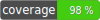

# SVC SDK for PHP

Services SDK for PHP - Use LifeMD Services in your PHP project.



## Installation

Installation via [Composer](https://getcomposer.org/). First, add the repository to your `composer.json` file:

```bash
"repositories":[
        {
            "type": "vcs",
            "url": "git@github.com:thecvlb/svc-sdk-php.git"
        }
    ]
```

And add the package to your `requirements`:
```bash
"thecvlb/svc-sdk-php": "2.*"
```

## Authentication

Your application will need an OAuth access token to make requests on the LifeMD Services API. Once your application is registered you can request the JWT with your `client_id` and `client_secret`. Your access  token will be stored in your Redis instance for the duration of its lifecycle. If the token is not found in Redis the SDK will request a new token and update Redis.

## Usage

Instantiate a new SVC SDK object and then make requests with the service endpoints.

```php
use \CVLB\Svc\Api\Sdk;
use \CVLB\Svc\Api\AuthService;
use \CVLB\Svc\Api\ClientBuilder;

$svc = new Sdk(new AuthService(new Redis(), ['client_id' => '<your client_id>', 'client_secret' => '<your client_secret>']), new ClientBuilder());
```

# Available Services

The following services are available:
- **Logging**: centralized logging
- **Data Segmentation Engine**: create and manage data segmentation lists
- **Notify**: centralized notifications across various protocols and services

See the sections below for details on each service.

## Logging

SVC Logging service allows you to send your application logs entries to a central repository. Documentation can be found at https://documenter.getpostman.com/view/16680838/UVeGpQY7

### Sample Requests
```php
$svc->logging()->put('Log this message');

// Or an Exception
\Exception $exception
$svc->logging()->put($exception->getMessage(), $exception->getTrace(), $exception->getCode());
```
### Response
```json
{
  "success": true,
  "code": 200,
  "message": "OK"
}
```
## Data Segmentation Engine

SVC DSE creates data segmentation lists from the AWS Data Lake. Documentation can be found at https://documenter.getpostman.com/view/16680838/2s93mBxKLk


### Sample Requests
```php
$svc->dse()->query("SELECT patient_id, dob FROM lakeformation_aurora.rexmd_rexmd_patients where gender = 'M' AND dob <= current_date - interval '40' year;");
```
### Response
```json
{
  "statusCode": 200,
  "message": "Query executed successfully",
  "query_execution_id": "0c35524d-4d91-4190-bf03-c4711dfd4185",
  "segmentation_list": [
    {
      "patient_id": "1680833",
      "dob": "1983-05-15"
    },
    {
      "patient_id": "570602",
      "dob": "1983-05-04"
    },
    {
      "patient_id": "1668479",
      "dob": "1983-04-26"
    },
    {
      "patient_id": "1160596",
      "dob": "1983-04-17"
    },
    {
      "patient_id": "1677675",
      "dob": "1983-04-10"
    }
  ]
}
```

### Other Requests
```php
// Operations on a specific list
$svc->dse()->create_list('abcd-1234', 'Test SDK', 'Test list using SDK', false);
$svc->dse()->view_list('abcd-1234');
$svc->dse()->update_list('abcd-1234', '5678-wxyz', 'Test SDK', 'Test list UPDATED using SDK', false);
$svc->dse()->refresh_list('abcd-1234');
$svc->dse()->delete_list('abcd-1234');

// Operations on all lists as a group
$svc->dse()->get_lists();
$svc->dse()->search_lists('description', 'up');
$svc->dse()->refresh_lists();

// Get data sources
$svc->dse()->get_databases();
$svc->dse()->get_tables('prm-database');
```

## Notify

SVC Notify service sends chat messages with Slack, email messages with AWS SES and SendPulse, and sms messages with Twilio. Documentation can be found at https://documenter.getpostman.com/view/16680838/2s8479zH7v

### Chat - Slack

Send messages to Slack. The current version uses the LifeMD Bot to deliver the messages. The Bot must be able to post messages to the specified channel.

`$message` is an array of json objects that conforms to the Slack API `chat.postMessage` format found at https://api.slack.com/methods/chat.postMessage#arg_blocks
#### Sample Request
```php
$message = [
    ["type"=>"header", "text"=>["type"=>"plain_text", "text"=>"New SDK request"]],
    ["type"=>"section", "text"=>["type"=>"mrkdwn", "text"=>"Sample <example.com|message> for *slack* endpoints"]]
];
$destination = ['slack_channel' => 'ABCD1234XYZ'];

$svc->notify()->chat()->slack()->send($message, $destination);
```

#### Response
```json
{
  "success": true,
  "code": 200,
  "message": "Slack message received"
}
```

### Email - SES

Send emails with AWS SES. The `from_address` must be a verified entity in SES account and region you are sending from.

#### Sample Request
```php
$destination = [
    'from_name' => 'SVC SDK',
    'from_address' => 'no-reply@dev.prm-lfmd.com',
    'to_name' => 'John Doe', // optional
    'to_address' => 'test@lifemd.com',
    'cc' => [ // optional
        ['address' => 'test@cc.com', 'to' => 'Jane Doe'] // 'to' is optional
    ], 
    'bcc' => [ // optional
        ['address' => 'test@bcc.com'] // 'to' is optional
    ] 
];
$message = [
    'email_subject' => 'SDK SES Email',
    'email_html_message' => "<html><head></head><body><h1>Amazon SES Test (SDK for Python)</h1><p>This email was sent with <a href='https://aws.amazon.com/ses/'>Amazon SES</a> using the <a href='https://aws.amazon.com/sdk-for-python/'>AWS SDK for Python (Boto)</a>.</p></body></html>",
    'email_text_message' => 'This is the plain text version of the email.'
];

$svc->notify()->email()->ses()->send($message, $destination);
```

#### Response
```json
{
  "PublishResponse": {
    "PublishResult": {
      "MessageId": "9c57ff86-4c4c-5df8-ae0f-a28242203f08",
      "SequenceNumber": null
    },
    "ResponseMetadata": {
      "RequestId": "fb61d2d9-c98e-594b-b616-8fddc7e2dbbb"
    }
  }
}
```

### Email - SendPulse

Send emails with SendPulse. The `from_address` must be an allowed sender in SendPulse.

#### Sample Request
```php
$destination = [
    'from_name' => 'SVC SDK',
    'from_address' => 'no-reply@rexmd.com',
    'to_address' => 'test@lifemd.com'
];
$message = [
    'email_subject' => 'SDK SendPulse Email',
    'email_html_message' => "<html><head></head><body><h1>Amazon SendPulse Test (SDK for Python)</h1><p>This email was sent with SendPulse using the <a href='https://aws.amazon.com/sdk-for-python/'>AWS SDK for Python (Boto)</a>.</p></body></html>",
    'email_text_message' => 'This is the plain text version of the email.'
];

$res = $svc->notify()->email()->sendpulse()->send( $message, $destination);
```

#### Response
```json
{
  "success": true,
  "code": 200,
  "message": "SendPulse message received"
}
```

### SMS - Twilio

Send sms messages with Twilio. The `from` must be an allowed sender in Twilio.

#### Sample Request
```php
$message = ['text' => 'Hello from SVC SDK'];
$destination = ['to'=>'+12223334444', 'from' => '+19998887777'];

$svc->notify()->sms()->twilio()->send($message, $destination);
```

#### Response
```json
{
  "success": true,
  "code": 200,
  "message": "Twilio message received"
}
```